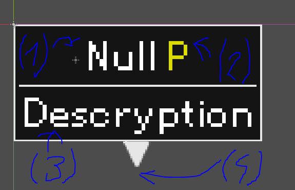

Interactable component adds eazy way to interac with ocjects. Simply add component to entity and set all export values. Resultat is apearing text when player is in range of interaction and emision of signal when interaction happend.  
  
To add some action to the interaction simply use emited signal.

Example :  
```

# Some entinty.gd with Interactable component.
func _on_interactable_component_interacted():
	print("interaction.")
```

#Setup



"interaction_input" : for seting insteraction method for example pressing button 'X'  
(1.) "interaction_title" : title of interaction  
(2.) "input_text" : interaction input for example "X"  
(3.) "interaction_descryption" : interaction descryption  
(4.) box_position : starting position it sets box on the tip of box arrow  
```
@export var interaction_input:InputEvent = null
@export var interaction_descryption:String = ""
@export var interaction_title:String = ""
@export var input_text:String = ""
@export var box_position:Vector2 = Vector2.ZERO
```
#Update visibility and position

For position best to use this function. Size of box might change if its descryption changes etc..  
This sets position directly below box arrow.
```
func set_box_position(pos:Vector2)
```
For visibility
```
func update_box()
```